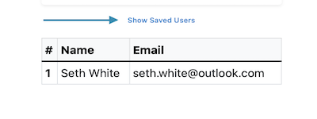
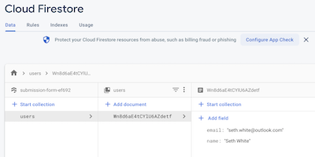

# submission-form
project submission

Tech Used: React, EmailJS and Firebase.
Other Tools: SweetAlerts and Bootstrap

On submit of form, button changes to saving/disabled animation until call to firebase is finished. Then SweetAlert tells user its saved.

This is what user receives in email after submitted form.

If you want to see persisted data from Firebase, click button text to show table with data. 

